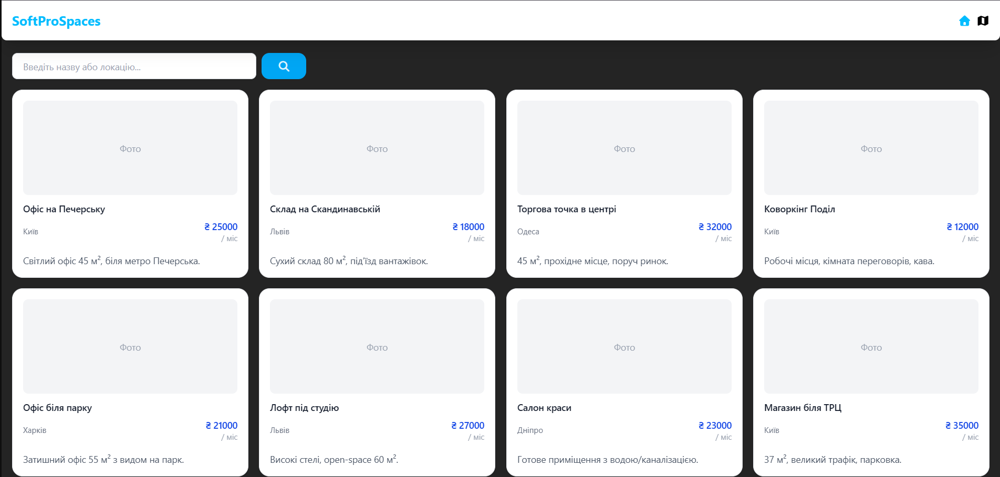
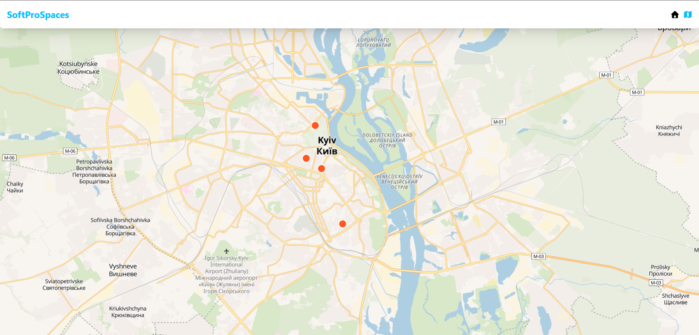
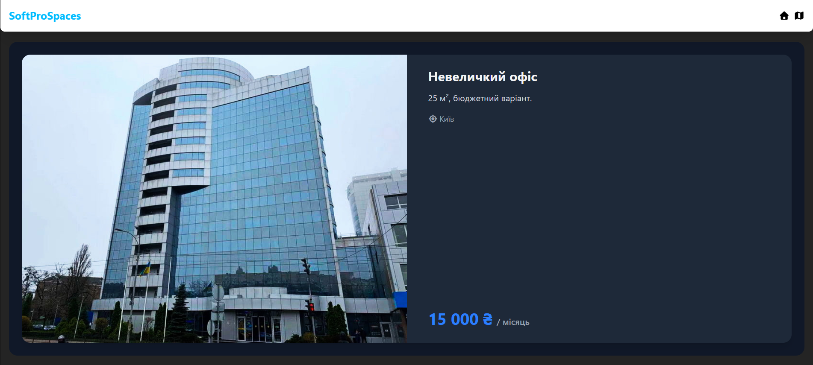

  
  
  

DEMO -  https://andrii-stiebalov.github.io/SoftProSpaces/

# SoftProSpaces

## Опис виконаної роботи
- **Vue 3 + Composition API**
- **TypeScript**
- **MapLibre GL**
- **TailwindCSS**
- **Pinia** для стану додатку
- **Vue Router** для навігації

## Часові витрати
| Задача | Час (години) |
|--------|--------------|
| Інтеграція карти та маркерів | 2 |
| Пагінація та фільтрація | 1 |
| Адаптивна верстка | 2 |
| Дебаг та оптимізація | 2 |
| **Всього** | **7** |

## Висновки та фідбек
Завдання було цікавим та корисним для перевірки практичних навичок у Vue та роботі з картами.  

